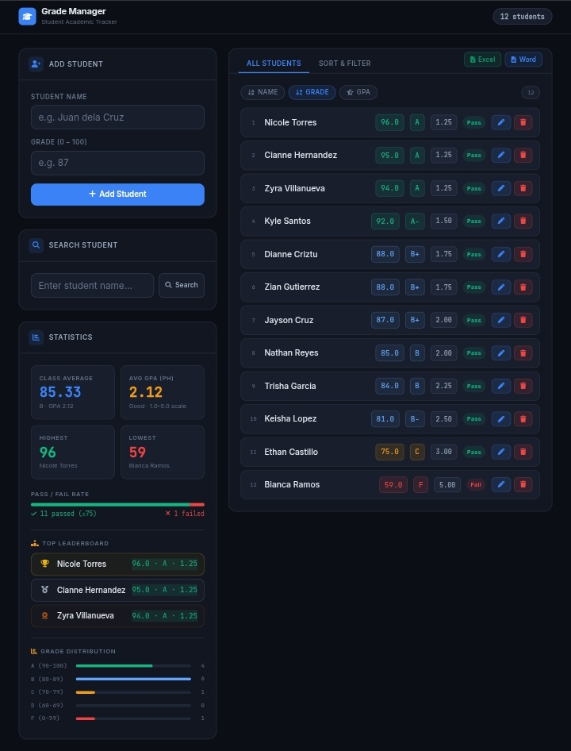

# Student Grade Manager

A web application for managing student grades, built with C# (.NET 7) and a custom HttpListener server.



## Features

### Student Management
- Add students with name and grade (0–100)
- Edit grades
- Delete students
- Search by name with instant results

### GPA Scale (CHED Standard)

| GPA  | Grade Range | Remarks      |
|------|-------------|--------------|
| 1.00 | 97–100      | Excellent    |
| 1.25 | 94–96       | Excellent    |
| 1.50 | 91–93       | Very Good    |
| 1.75 | 88–90       | Very Good    |
| 2.00 | 85–87       | Good         |
| 2.25 | 82–84       | Good         |
| 2.50 | 79–81       | Satisfactory |
| 2.75 | 76–78       | Satisfactory |
| 3.00 | 75          | Passing      |
| 5.00 | Below 75    | Failed       |

### Statistics
- Class average with letter grade and GPA
- Average GPA with remarks
- Highest and lowest scoring student
- Pass/Fail tracking (passing threshold: 75)
- Pass/Fail rate bar chart
- Top 3 leaderboard with gold/silver/bronze medals
- Grade distribution (A / B / C / D / F)

### Sorting
- Sort by name (alphabetical)
- Sort by grade (highest first)
- Sort by GPA (best GPA first — 1.00 to 5.00)
- Side-by-side Sort & Filter tab with all three columns

### Export
- **Excel (.xlsx)** — Two-sheet workbook: color-coded Student Roster (name, grade, letter, PH GPA, remarks, status) and a Statistics sheet with summary, top performers, and full GPA legend
- **Word (.docx)** — Formatted document with student table, statistics summary, top performers, and embedded GPA scale table

### Data
- Auto-save to `students.txt` (pipe-delimited)
- Auto-load on startup
- No database required

### Validation
- Grade must be between 0 and 100
- Duplicate student names are rejected
- Empty name is rejected

## Tech Stack

- **Backend:** C# (.NET 7), custom `HttpListener` HTTP server
- **Frontend:** Vanilla HTML / CSS / JavaScript (no framework)
- **Fonts:** Inter (UI), JetBrains Mono (numbers)
- **Icons:** Font Awesome 6
- **Excel export:** ExcelJS (lazy-loaded from CDN)
- **Word export:** JSZip with raw OOXML (lazy-loaded from CDN)
- **Port:** 5000

## Requirements

- [.NET 7 SDK](https://dotnet.microsoft.com/download/dotnet/7.0) or later

## Run

```bash
dotnet run
```

Then open **http://localhost:5000** in your browser.

## API Endpoints

| Method | Endpoint                   | Description           |
|--------|----------------------------|-----------------------|
| GET    | `/api/students?sort=name`  | List students by name |
| GET    | `/api/students?sort=grade` | List students by grade|
| GET    | `/api/students?sort=gpa`   | List students by GPA  |
| POST   | `/api/students`            | Add new student       |
| PUT    | `/api/students/{name}`     | Update student grade  |
| DELETE | `/api/students/{name}`     | Remove student        |
| GET    | `/api/search?q={name}`     | Search for a student  |
| GET    | `/api/stats`               | Get class statistics  |
