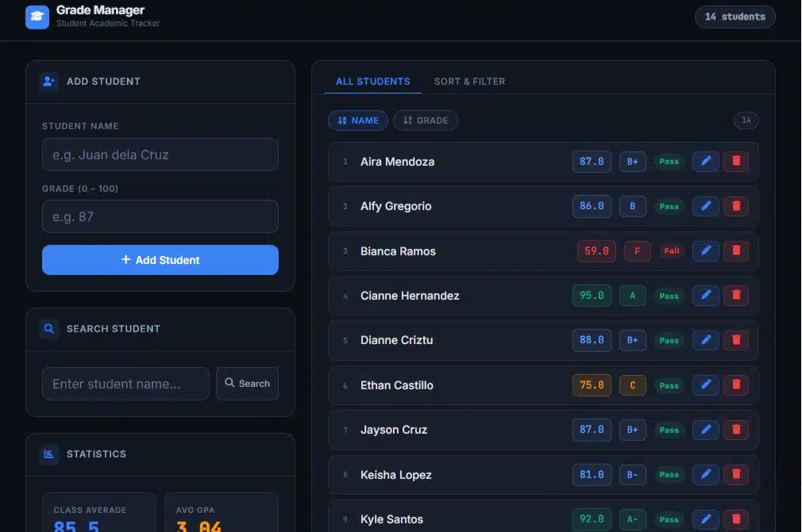

# 🎓 Student Grade Manager

A C# web application for managing student grades.



## Features

### Student Management
- ✅ Add students with name + grade
- ✅ Edit grades (modal dialog)
- ✅ Delete students
- ✅ Search by name

### Statistics
- ✅ Class average
- ✅ Highest & lowest grade
- ✅ Pass/Fail tracking (≥75 = Pass)
- ✅ GPA calculation (4.0 scale)
- ✅ Top 3 leaderboard with medals
- ✅ Grade distribution (A/B/C/D/F)

### Sorting 
- ✅ Sort by name (alphabetical)
- ✅ Sort by grade 

### Data Management
- ✅ Auto-save to `students.txt`
- ✅ Auto-load on startup

### Validation
- ✅ Rejects grades > 100
- ✅ Rejects negative grades
- ✅ Prevents duplicate names

## Requirements

- [.NET 8.0 SDK](https://dotnet.microsoft.com/download/dotnet/8.0)

## Setup & Run

### Windows
```
double-click run.bat
```
Or in terminal:
```
dotnet run
```

### Linux / macOS
```bash
chmod +x run.sh
./run.sh
```

### Manual
```bash
dotnet build
dotnet run
```

Then open **http://localhost:5050** in your browser.

## API Endpoints

| Method | Endpoint | Description |
|--------|----------|-------------|
| GET | `/api/students?sort=name` | List all students |
| POST | `/api/students` | Add new student |
| PUT | `/api/students/{name}` | Update grade |
| DELETE | `/api/students/{name}` | Remove student |
| GET | `/api/search?q={name}` | Search student |
| GET | `/api/stats` | Get statistics |
